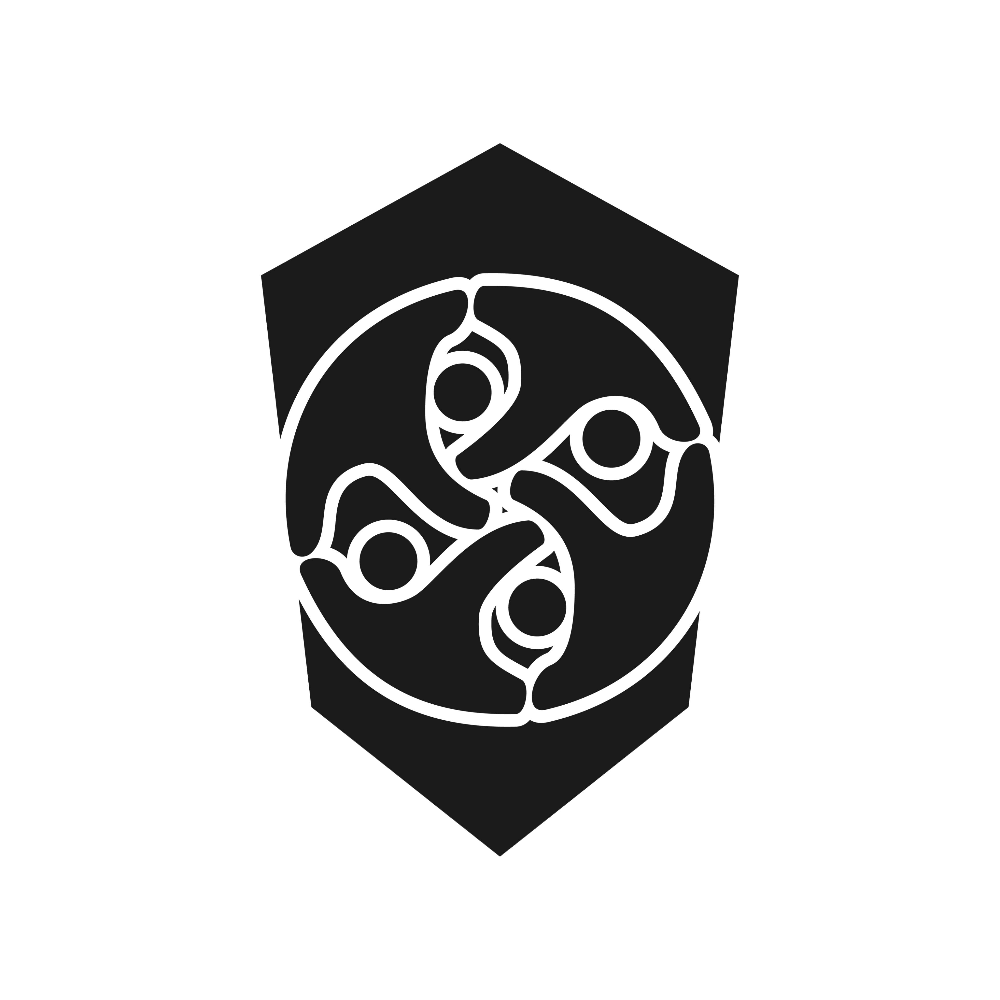

# Web3 Security Reviews Portfolio

## Description

This repository showcases a collection of Web3 security reviews conducted by [Ethereal Audits](https://github.com/aciDrums7). We specialize in assessing the security of Web3 applications, smart contracts, and related technologies.

## Technologies Used

- Ethereum
- Solidity
- Foundry

## Key Features

- **Comprehensive Audits:** Conducting thorough assessments of Web3 applications and smart contracts to identify and address potential security vulnerabilities.

- **Custom Security Solutions:** Tailoring security solutions to the specific needs and requirements of each project, ensuring a robust defense against potential threats.

- **Educational Resources:** Providing educational materials and resources to help developers and organizations enhance their understanding of Web3 security best practices.

- **Ongoing Support:** Offering continuous support to address security concerns, implement updates, and adapt to evolving threats in the Web3 space.

## Audit Reports

| Date       | Report                                                          |
| ---------- | --------------------------------------------------------------- |
| 2023-12-19 | [Password Store](./reports/2023-12-19-password-store-audit.pdf) |
| 2024-01-12 | [Puppy Raffle](./reports/2024-01-12-puppy-raffle-audit.pdf)     |

## Contact Information
To request an audit or get information, contact me: 

- Email: [edoardo.carradori.96@gmail.com](mailto:edoardo.carradori.96@gmail.com?subject=%3CYOUR_PROTOCOL_NAME%3E%20Audit%20Request)
- Twitter: [aciDrums7](https://twitter.com/aciDrums7)
- Telegram: [aciDrums7](https://t.me/aciDrums7)
- Discord: [aciDrums7](https://discordapp.com/users/acidrums7)
- LinkedIn: [Edoardo Carradori](https://www.linkedin.com/in/edoardo-carradori-866233223/?locale=en_US)
